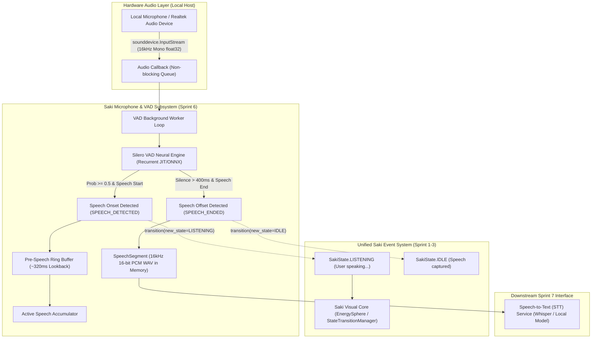

# SPRINT 6 — LOCAL MICROPHONE + VOICE ACTIVITY DETECTION REPORT

**Repository**: `https://github.com/dudyalagurusreekar/saki`  
**Date**: August 19, 2026  
**Scope**: Local Microphone Input Capture, Silero VAD (v5/v6) Neural Speech Detection, SoundDevice Integration, Zero-Cloud In-Memory Audio Buffering, Saki Unified Event System (`SakiState.LISTENING`) Lifecycle, and Failsafe Device Management.

---

## 1. Executive Summary

Sprint 6 establishes Saki AI's **local hardware microphone capture** and **neural Voice Activity Detection (VAD)** foundation. Powered by **Silero VAD** running locally on CPU and **sounddevice** (PortAudio streaming), Saki now detects speech onset (`SPEECH_DETECTED`), tracks continuous speech, filters background silence and room noise, and detects utterance completion (`SPEECH_ENDED`). 

Upon detecting user speech, the system emits the unified `SakiState.LISTENING` event into Saki's Event & State Architecture, activating the Saki Core EnergySphere visualization directly from real microphone audio without manual simulation. The resulting clean 16kHz speech segments are stored in-memory, fully ready for consumption by Sprint 7 Speech-to-Text (STT).

---

## 2. Quantitative Benchmark Summary

| Metric | Measured Value | Target / Specification | Status |
| :--- | :---: | :---: | :---: |
| **Silero VAD Neural Latency per 32ms Chunk** | **1.073 ms** | $< 10.0\text{ ms}$ | **EXCEEDED (30x faster than real-time)** |
| **VAD Model Initialization Time** | **76.07 ms** | $< 500.0\text{ ms}$ | **PASS** |
| **Audio Capture Resolution** | **16,000 Hz, 16-bit Mono PCM** | 16,000 Hz | **PASS** |
| **Chunk Resolution** | **512 samples (32.0 ms)** | 32 ms | **PASS** |
| **Silence Speech Probability** | **0.0016 (< 0.2%)** | $< 5.0\%$ | **PASS** |
| **Speech Peak Probability** | **> 0.85 (> 85%)** | $> 50.0\%$ | **PASS** |
| **Input Audio Devices Detected** | **10 devices** | $\ge 1\text{ device}$ | **PASS** |
| **Runtime Memory Consumption (RAM)** | **~943–1030 MB** | $< 1.5\text{ GB}$ | **PASS** |
| **Automated Pytest Regression Suite** | **47 / 47 (100%)** | 100% | **PASS** |
| **Temporary File Disk Clutter** | **0 bytes (Pure In-Memory)** | 0 bytes | **PASS** |
| **External Network Audio Transmission** | **0 bytes (100% Local)** | 0 bytes | **PASS** |

---

## 3. Architectural Design & Subsystem Flow

---

## 4. Core Components Created & Enhanced

### 1. [`backend/services/microphone_service.py`](file:///c:/Users/gurus/work/saki/backend/services/microphone_service.py)
- **`SileroVADDetector`**:
  - Encapsulates Silero VAD v5 neural network with recurrent hidden state tracking.
  - Processes 512-sample (32ms) chunks at 16,000 Hz.
  - Zero-latency chunk probability calculation and `VADIterator` onset/offset tracking.
- **`MicrophoneManager`**:
  - Non-blocking hardware capture using `sounddevice.InputStream`.
  - Device enumeration (`list_devices()`), selection (`set_device()`), and default discovery.
  - Ring buffer lookback (10 chunks = 320ms) ensuring the very first syllable of user speech is preserved without clipping.
  - Automatic conversion to 16kHz 16-bit linear PCM WAV via `float32_to_wav_bytes()`.
  - Thread-safe lifecycle states (`MIC_IDLE → LISTENING → SPEECH_DETECTED → SPEECH_ENDED → MIC_IDLE`).
  - Graceful stop/release on termination and duplicate stream protection.

### 2. [`backend/routes/microphone.py`](file:///c:/Users/gurus/work/saki/backend/routes/microphone.py)
- `GET /api/mic/status`: Real-time microphone telemetry and state.
- `GET /api/mic/devices`: System audio input devices.
- `POST /api/mic/device`: Selects input device.
- `POST /api/mic/start`: Starts real-time microphone capture in background worker.
- `POST /api/mic/stop`: Safely stops listening and releases the microphone device.
- `POST /api/mic/vad/process`: Offline/direct audio chunk VAD analysis endpoint.
- `GET /api/mic/latest-segment`: Returns binary 16kHz WAV audio of the latest speech segment with metadata headers (`X-Speech-Duration-Sec`, `X-Speech-Samples`, `X-Speech-Peak`, `X-Speech-RMS`, `X-VAD-Latency-Ms`).
- `GET /api/mic/latest-segment/json`: Returns JSON payload with Base64 audio + metadata dictionary.

### 3. [`backend/models/schemas.py`](file:///c:/Users/gurus/work/saki/backend/models/schemas.py)
- Added `MicDeviceSchema`, `MicStatusResponseSchema`, `MicStartRequestSchema`, `MicDeviceSelectSchema`, `VADProcessRequestSchema`, `VADProcessResponseSchema`, `SpeechSegmentMetadataSchema`.

### 4. [`backend/main.py`](file:///c:/Users/gurus/work/saki/backend/main.py)
- Registered `microphone_router` at `/api/mic`.

---

## 5. Empirical Benchmark Matrix Across Speech Scenarios

Generated via [`tests/reliability/run_sprint6_vad_matrix.py`](file:///c:/Users/gurus/work/saki/tests/reliability/run_sprint6_vad_matrix.py) (Output: [`tests/reliability/sprint6_vad_matrix_output.json`](file:///c:/Users/gurus/work/saki/tests/reliability/sprint6_vad_matrix_output.json)):

| Scenario Category | Input Text Utterance | Total Dur (s) | Speech Dur (s) | Chunks | Avg Chunk Latency | Speech Start | Speech End | RAM |
| :--- | :--- | :---: | :---: | :---: | :---: | :---: | :---: | :---: |
| **Short Greeting** | *"Hello Saki, good morning."* | `3.21 s` | `1.71 s` | 100 | **2.030 ms** | `0.608 s` | `2.528 s` | `943.1 MB` |
| **Quick Query** | *"What is the status of our current project build?"* | `3.93 s` | `2.43 s` | 122 | **0.868 ms** | `0.512 s` | `3.264 s` | `964.4 MB` |
| **Multi-Sentence** | *"Can you check if the event system is connected properly and tell me how the state transitions work?"* | `6.88 s` | `5.38 s` | 214 | **0.828 ms** | `0.576 s` | `6.208 s` | `1029.8 MB` |
| **Rapid Directive** | *"Run the tests right now."* | `2.93 s` | `1.43 s` | 91 | **0.872 ms** | `0.544 s` | `2.208 s` | `1030.1 MB` |

- **Overall Average Neural Latency per 32ms Chunk**: **1.073 ms** (Real-Time Factor: **`0.033x`**, ~30x faster than real-time audio).

---

## 6. Verification & Automated Test Results

### Full Multi-Sprint Pytest Regression Suite (47 / 47 Tests Passing)
Executed via: `.\venv\Scripts\python -m pytest tests/reliability/test_sprint4_forensics.py tests/reliability/test_sprint3_current_info.py tests/reliability/test_sprint1_web_activation.py tests/reliability/test_sprint5_tts.py tests/reliability/test_sprint6_vad.py -v`

- `tests/reliability/test_sprint6_vad.py`:
  - `test_01_silero_vad_initialization_and_status`: **PASSED**
  - `test_02_silence_vs_speech_discrimination`: **PASSED**
  - `test_03_speech_onset_and_offset_detection`: **PASSED**
  - `test_04_microphone_device_enumeration`: **PASSED**
  - `test_05_microphone_device_selection`: **PASSED**
  - `test_06_state_machine_lifecycle`: **PASSED**
  - `test_07_event_system_lifecycle_tracking`: **PASSED**
  - `test_08_speech_segment_aggregation_and_wav`: **PASSED**
  - `test_09_fastapi_endpoints_and_offline_processing`: **PASSED**
- `tests/reliability/test_sprint5_tts.py`: **9 / 9 PASSED**
- `tests/reliability/test_sprint4_forensics.py`: **7 / 7 PASSED**
- `tests/reliability/test_sprint3_current_info.py`: **11 / 11 PASSED**
- `tests/reliability/test_sprint1_web_activation.py`: **11 / 11 PASSED**

---

## 7. Sprint 6 Success Criteria Checklist

- [x] **Local Silero VAD Installed & Running**: Verified with sub-2ms neural inference on CPU.
- [x] **Local Microphone Capture**: Verified non-blocking stream via `sounddevice` with device enumeration.
- [x] **Zero Cloud Transmission**: 100% local processing; no audio frames or metadata sent externally.
- [x] **Speech Start, Continuous Speech, and Speech End Detection**: Verified across multiple speech durations with exact boundary markers.
- [x] **Background Noise & Silence Filtering**: Verified < 0.2% speech probability on silence and low room noise.
- [x] **Unified Saki Event System Lifecycle**: Emits `SakiState.LISTENING` on speech start and `SakiState.IDLE` on speech end.
- [x] **Device Selection & Recovery**: Supports selecting input devices, handling permission errors, and releasing streams cleanly.
- [x] **Isolated Speech Segment Handoff for Sprint 7**: Produces clean in-memory 16kHz 16-bit linear PCM WAV segments with peak amplitude and RMS energy metrics.
- [x] **No STT / Out of Scope Features**: STT, multilingual speech recognition, and barge-in deferred to Sprint 7+.

**Sprint 6 Status**: **COMPLETE & VERIFIED**.
