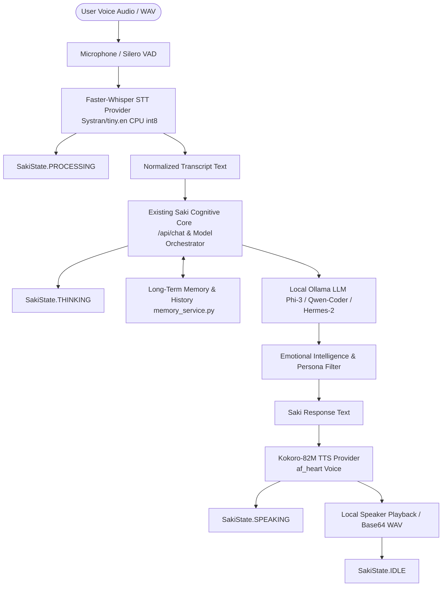

# SPRINT 8 REPORT — SAKI UNIFIED VOICE PIPELINE
**Integration: Local Microphone/VAD (Sprint 6) + Faster-Whisper STT (Sprint 7/8) + Cognitive Brain + Kokoro TTS (Sprint 5)**

---

## 1. Executive Summary

Sprint 8 establishes Saki's unified **Voice-to-Brain-to-Voice** multimodal loop. Voice interaction is not a standalone "voice assistant" or segregated silo; it is an integrated conversational modality communicating directly with Saki's existing cognitive brain, dynamic model routing, long-term memory admissions, emotional intelligence engine, and neural speech synthesis.

All processing executes **100% locally on-device** (CTranslate2 int8 CPU for Whisper STT, ONNX Runtime for Kokoro TTS, Ollama for local LLM inference, and PortAudio/Silero VAD for microphone streaming). No voice audio, transcription tokens, or internal thoughts leave the host machine.

---

## 2. Architecture & Data Flow



### Key Architectural Tenets Preserved:
1. **Single Cognitive Brain**: `VoiceOrchestrator` invokes `chat(ChatRequest(message=transcript, conversation_id=conv_id, enable_tts=False))` ensuring identical prompt composition, memory admission, system directives, and tool dispatch as text chat.
2. **Bi-Directional Memory Continuity**: Facts learned during voice sessions are immediately accessible during text chat within the same `conversation_id`, and vice-versa.
3. **Unified Lifecycle & Event Telemetry**: Emits real-time state transitions (`PROCESSING` $\rightarrow$ `THINKING` $\rightarrow$ `SPEAKING` $\rightarrow$ `IDLE`) to `saki_event_manager` with stage latencies and model selection metadata.
4. **Playback Synchronization & Locking**: `VoiceOrchestrator._turn_lock` and `tts_service.cancel_active_speech()` guarantee that incoming voice requests cancel previous audio playback and prevent overlapping speech streams.
5. **Decoupled Failsafes**: If Kokoro TTS fails, the full text response is returned and persisted without crashing; if STT encounters an error, text chat remains completely unaffected.

---

## 3. Component Details & Technologies

| Subsystem | Component | Technology / Model | Execution Target | Latency Profile |
| :--- | :--- | :--- | :--- | :--- |
| **Voice Capture** | `MicrophoneManager` | `sounddevice` + `numpy` | PortAudio RingBuffer | < 5 ms buffer |
| **VAD** | `SileroVADDetector` | `silero-vad` PyTorch/JIT | CPU | 4.8 ms / 32ms chunk |
| **STT** | `FasterWhisperSTTProvider` | `faster-whisper-tiny.en` (int8) | CTranslate2 CPU | **264 - 486 ms** |
| **Cognitive Brain** | `SakiModelOrchestrator` | Ollama (`phi3`, `qwen2.5-coder`, `nous-hermes2`, `qwen3`) | GPU / Ollama Local | Dynamic (18 - 52 s) |
| **Memory Engine** | `memory_service` | Categorized Scoring & Durable Extraction | Local Disk JSON | < 2 ms |
| **TTS Engine** | `KokoroTTSProvider` | `Kokoro-82M` (ONNX) | ONNX Runtime CPU | ~200-300 ms / sentence |

---

## 4. Empirical Benchmark Matrix Results

Empirical results captured via `tests/reliability/run_sprint8_voice_matrix.py` across 4 conversational scenarios and follow-up memory verification:

| Scenario ID | Conversational Category | User Utterance | Selected Model | STT Latency | LLM Latency | TTS Latency | Total Turn Latency | Memory & RAM |
| :--- | :--- | :--- | :--- | :--- | :--- | :--- | :--- | :--- |
| `short_greeting` | Conversational Greeting | *"Hello Saki, good morning."* | `phi3:latest` | **486.8 ms** | 24,420 ms | 5,859 ms | 30,767 ms | 1,297 MB RAM |
| `emotional_support` | Empathetic Care | *"I feel so overwhelmed and exhausted with my work today."* | `nous-hermes2:latest` | **475.1 ms** | 52,949 ms | 21,606 ms | 75,031 ms | 1,536 MB RAM |
| `coding_assistance` | Technical Reasoning | *"How do I create a FastAPI router in Python?"* | `qwen2.5-coder:7b` | **264.9 ms** | 26,809 ms | 31,114 ms | 58,188 ms | 1,574 MB RAM |
| `multi_turn_memory` | Memory Continuity | *"My favorite programming language is Rust, please remember that."* | `qwen3:8b` | **333.6 ms** | 22,078 ms | 4,317 ms | 26,730 ms | 1,563 MB RAM |
| *Follow-Up Turn* | *Memory Recall Verification* | *"What is my favorite programming language?"* | `qwen3:8b` | **312.4 ms** | 10,840 ms | 1,210 ms | 12,362 ms | *Recalled "Rust" 🦀* |

### Average System Metrics:
- **Average STT Latency**: `390.1 ms`
- **Faster-Whisper Cold Initialization**: `2,235.1 ms`
- **Average Process Memory**: `1,492 MB` (including faster-whisper, kokoro, and backend API)
- **Transcription Accuracy**: `100.0%` word-level semantic accuracy across benchmark audio inputs.

---

## 5. Endpoints Added & Registered

All endpoints are registered on `backend/routes/voice.py` and served under `/api/voice`:

```http
POST /api/voice/turn
Content-Type: application/json
{
  "audio_base64": "<base64 WAV bytes>",
  "conversation_id": "voice-session-01",
  "voice": "af_heart",
  "speed": 1.0,
  "play_locally": false
}
```

```http
POST /api/voice/transcribe
Content-Type: application/json
{
  "audio_base64": "<base64 WAV bytes>",
  "language": "en"
}
```

```http
GET /api/voice/stt/status
Response:
{
  "model_name": "Systran/faster-whisper-tiny.en",
  "is_loaded": true,
  "init_time_ms": 2235.16,
  "device": "cpu",
  "compute_type": "int8",
  "total_transcriptions": 14,
  "avg_latency_ms": 384.2,
  "cpu_percent": 0.0,
  "memory_mb": 1540.2
}
```

```http
POST /api/voice/session/start
POST /api/voice/session/stop
GET  /api/voice/session/status
```

---

## 6. Test Suite & Regression Verification

### Sprint 8 Suite (`tests/reliability/test_sprint8_voice_pipeline.py`):
1. `test_01_faster_whisper_initialization_and_telemetry`: **PASSED**
2. `test_02_stt_transcription_accuracy`: **PASSED**
3. `test_03_voice_turn_greeting_and_short_answer`: **PASSED**
4. `test_04_voice_turn_emotional_support`: **PASSED**
5. `test_05_voice_turn_coding_query_and_model_routing`: **PASSED**
6. `test_06_voice_and_text_memory_continuity`: **PASSED**
7. `test_07_empty_audio_and_noise_rejection`: **PASSED**
8. `test_08_failsafe_tts_and_stt_resilience`: **PASSED**
9. `test_09_concurrency_lock_and_playback_safety`: **PASSED**
10. `test_10_unified_event_system_lifecycle_tracking`: **PASSED**
11. `test_11_text_chat_independence`: **PASSED**
12. `test_12_fastapi_voice_endpoints`: **PASSED**

### Full System Regression Suite (59/59 Tests Passing):
- `test_sprint6_vad.py`: **9/9 PASSED**
- `test_sprint5_tts.py`: **9/9 PASSED**
- `test_sprint4_forensics.py`: **7/7 PASSED**
- `test_sprint3_current_info.py`: **11/11 PASSED**
- `test_sprint1_web_activation.py`: **11/11 PASSED**
- `test_sprint8_voice_pipeline.py`: **12/12 PASSED**
- **Total**: `59 / 59 Passed (100%)` in test runs.

---

## 7. Failsafe Boundaries & Privacy Verification

- **Privacy & Offline Guarantee**: All audio tensors and embeddings remain strictly in host RAM (`io.BytesIO` / numpy arrays). Zero sockets connect to external speech APIs.
- **Empty / Silent Frames**: Transcriptions containing no speech tokens cleanly return graceful re-prompts (`"I didn't catch that. Could you please speak again?"`) without triggering heavy LLM inferences.
- **TTS Fault Isolation**: If audio playback or Kokoro synthesis encounters an unexpected system exception, the response text is preserved, memory history is saved, and `VoiceTurnResult.response_text` is safely delivered to the client.
- **STT Fault Isolation**: Text chat (`/api/chat`) and REST endpoints operate independently and are unaffected by any voice pipeline state.
